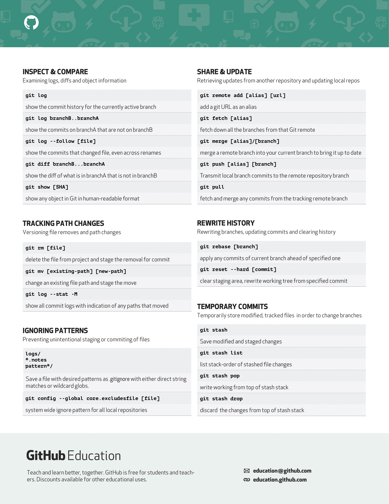

# Git Foundations

#### 😶‍🌫️ References 🔽

- [Official Documentation](https://git-scm.com/docs)
- [Adding locally hosted code to GitHub]()

#### 😶‍🌫️ Notes 🔽

1. [`git status`](./git-lessons/git-status.md)
2. [`git add`](./git-lessons/git-add.md)
3. [`git commit`](./git-lessons/git-commit.md)
4. [`git restore --staged`](./git-lessons/git-restored--staged.md)
5. [`git log`](./git-lessons/git-log.md)
6. [`git reset`](./git-lessons/git-reset.md)
7. [`git stash`](./git-lessons/git-stash.md)
8. [`git remote`](./git-lessons/git-remote.md)
9. [`git pull`](./git-lessons/git-pull.md)
10. [`git push`](./git-lessons/git-push.md)
11. [`git branch`](./git-lessons/git-branch.md)
12. [`git fetch`]()
13. [`git merge`](./git-lessons/git-merge.md)
14. [`git pull request`](./git-lessons/git-pull-request.md)
15. [`git fetch upstream`](./git-lessons/git-fetch-upstream.md)

#### [😶‍🌫️Git Quick Cheatsheet 🔽](./git-lessons/git-cheat-sheet-education.pdf)

#### 😶‍🌫️ Video Tutorials 🔽

- [Git and GitHub By Kunal Kushwaha](https://www.youtube.com/watch?v=apGV9Kg7ics)
